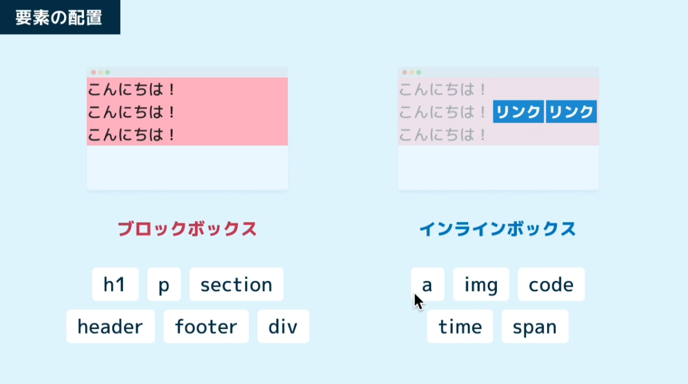
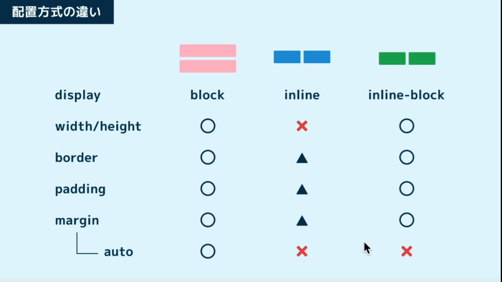
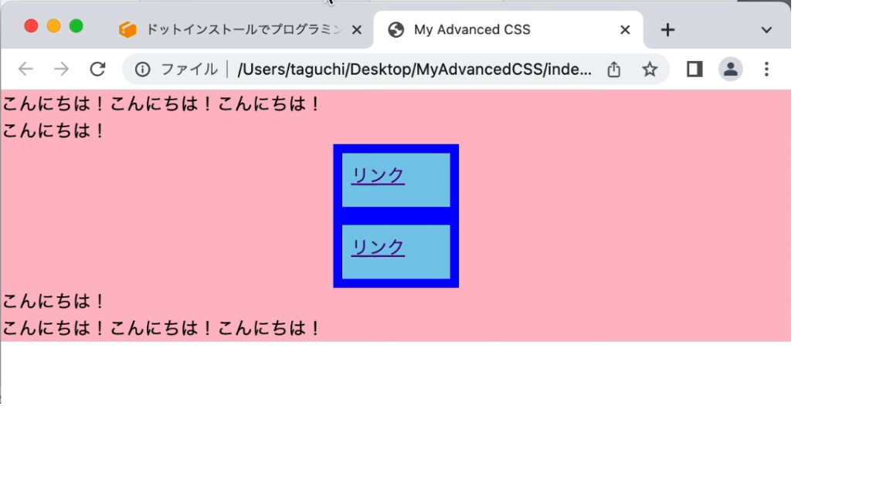
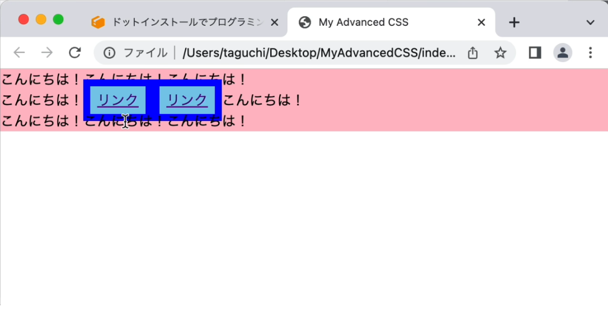
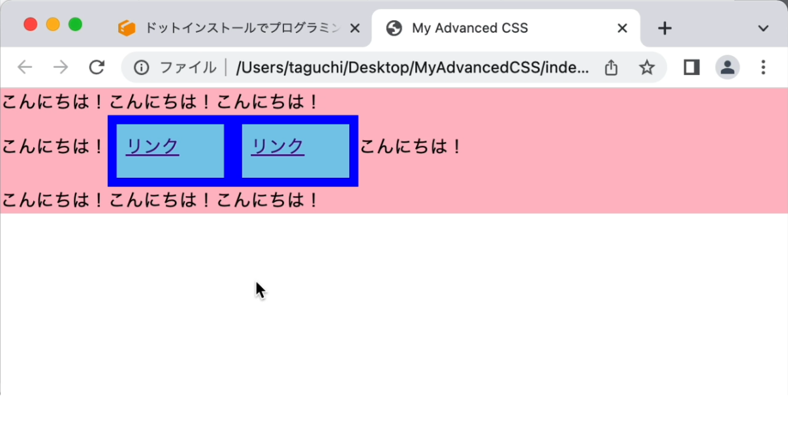

# [HTML/CSS] 

**Date:** 2026年2月7日  
**Study Time:** 2時間  
**TAG:** #HTML/CSS

## 1. Today
- CSS入門 応用スタイリング編

## 2. Record & Comment 

## [ブロックボックスとインラインボックス]

### 要素の配置には２種類ある



### displayプロパティの挙動

- display: block;
- display: inline;
- display: inline-block;




### aタブでdisplayプロパティの挙動確認

```HTML
<!DOCTYPE html>
<html lang="ja">
<head>
  <meta charset="UTF-8">
  <meta http-equiv="X-UA-Compatible" content="IE=edge">
  <meta name="viewport" content="width=device-width, initial-scale=1.0">
  <title>My Advanced CSS</title>
  <link rel="stylesheet" href="style.css">
</head>
<body>
  <p>こんにちは！こんにちは！こんにちは！</p>
  <p>こんにちは！<a href="">リンク</a><a href="">リンク</a>こんにちは！</p>
  <p>こんにちは！こんにちは！こんにちは！</p>
</body>
</html>
```

```CSS
charset "utf-8";

body {
  margin: 0;
}

p {
  background-color: pink;
  margin: 0;
}

a {
  background-color: skyblue;
  width: 80px;
  height: 32px;
  border: 8px solid blue;
  padding: 8px;
  /* margin: 8px; */
  margin: 0 auto;
  /* display: block; */
  /* display: inline; */
  display: inline-block;
}
```
**display: block;**


**display: inline;**


**display: inline-block;**


---

## Diary  
ようやく果樹たちの鉢替えを行った  
今回からは肥料は合成肥料ではなく配合肥料に変更  
コスパとおいしさをもとめてトライ  
今年はシャインマスカットとレモンとオレンジに期待  

補完候補に慣れてきた、むしろ便利すぎる  
しかし、たくさんのプロパティは覚えきれないので一覧表が欲しい  
どこかで探すか自分専用で作るか悩ましい  
まずは時間が惜しいのでどこかで探そっかな  