# [HTML/CSS] 

**Date:** 2026年2月8日  
**Study Time:** 6時間  
**TAG:** #MySQL #Python #GitHub #WindowsServer

## 1. Today
- positionプロパティの挙動
- z-indexプロパティで要素の重なり順を制御
- object-fit, opacityプロパティ
- baseline(vertical-alignプロパティ)
- float, display, clearプロパティ
- 背景画像
- リンクのスタイリング
- ボタンのスタイリング
- テーブルのスタイリング

## 2. Record & Comment 

## [positionプロパティの挙動]

【画像補足】 全て真ん中の `skyblueのbox` に対する挙動で説明  

HTMLコード
```html
<!DOCTYPE html>
<html lang="ja">
<head>
  <meta charset="UTF-8">
  <meta name="viewport" content="width=device-width, initial-scale=1.0">
  <title>Document</title>
  <link rel="stylesheet" href="style.css">
</head>
<body class="container">
  <div>
    <div class="box-1">Box 1</div>
    <div class="box-2">Box 2</div>
    <div class="box-3">Box 3</div>
  </div>
</body>
</html>
```

---

### static  
- 初期値(初期値なので明示的に指定することはほぼない)
- 挙動としては、通常通りに配置する

CSSコード
```css
@charset "utf-8";

body {
  margin: 0;
}

.container {
  margin: 32px auto 0;
  width: 400px;
  border: 8px solid blue;
}

.box-1 {
  width: 100px;
  height: 100px;
  background-color: pink;
}

.box-2 {
  width: 100px;
  height: 40px;
  background-color: skyblue;
}

.box-3 {
  width: 100px;
  height: 100px;
  background-color: orange;
}
```

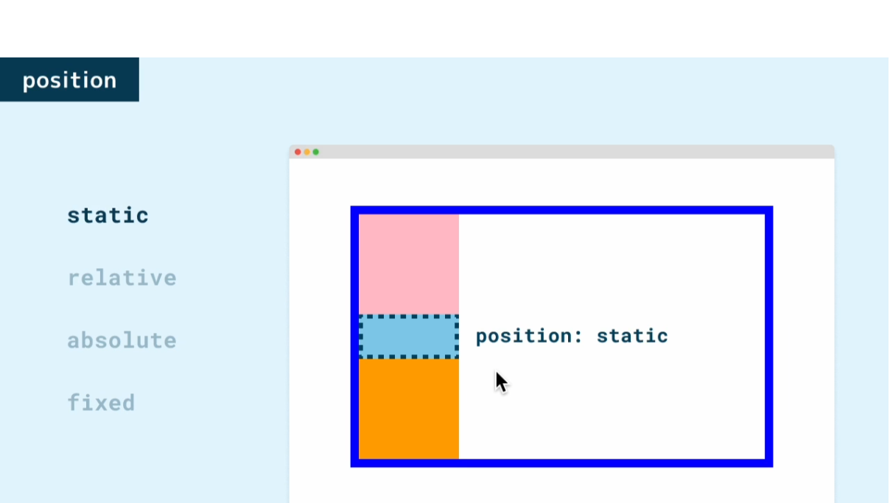

---

### relative  
- 相対位置指定で、`static`の位置からずらして配置する
- 指定は top, right, bottom, left のプロパティと組み合わせる
- `top: 16px`とすると上側を`16px`離すという意味になる
- `top: -16px`とすると下側を`16px`離すという意味になる
- 他の要素の位置には影響を与えない

CSSコード(.box-2 抜粋)
```css
.box-2 {
  width: 100px;
  height: 40px;
  background-color: skyblue;
  position: relative;
  top: -16px;
  left: 16px;
}
```

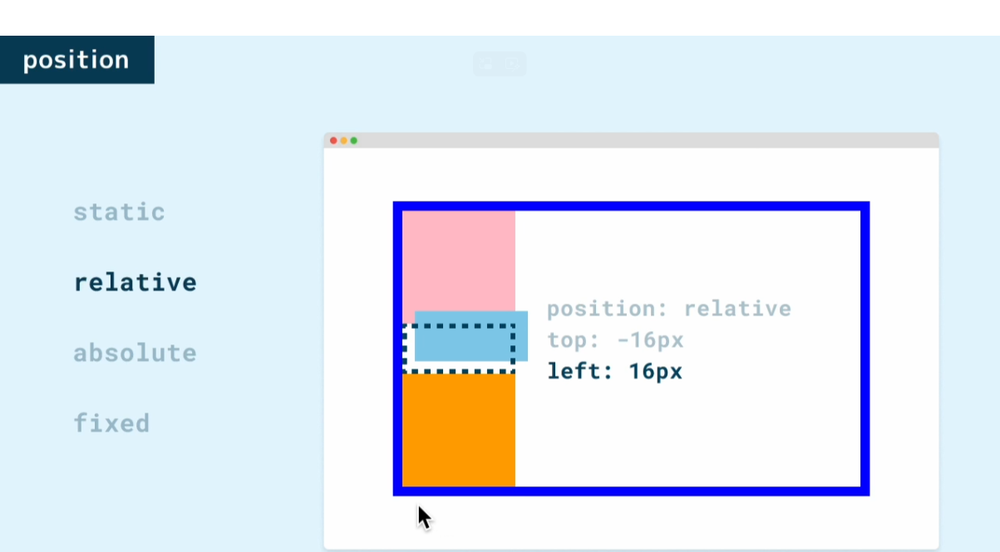

---

### absolute  
- 絶対位置指定で、ブラウザで見ている領域からずらして配置する
- 要素を囲む要素に `position: static` 以外の値、大抵は `position: relative` を使うのですが、これら両方を指定するとこちらの要素を基準に配置することができて、こちらの方がよく使われます
- 他の要素の位置に影響を与える(その後に続く要素は詰めて配置される)
- position: absolute の場合、ページが長くなった時にスクロールすると他の要素と一緒に流れていってしまう

CSSコード(.container と .box-2 に positionプロパティを設定)  
.box-2 を囲っている .container に position: relative; を指定している  
```css
.container {
  margin: 32px auto 0;
  width: 400px;
  border: 8px solid blue;
  position: relative;  <-- この要素を基準とさせる
}

.box-1 {
  width: 100px;
  height: 100px;
  background-color: pink;
}

.box-2 {
  width: 100px;
  height: 40px;
  background-color: skyblue;
  /* position: relative; */
  position: absolute;
  top: 16px;
  right: 16px;
}
```


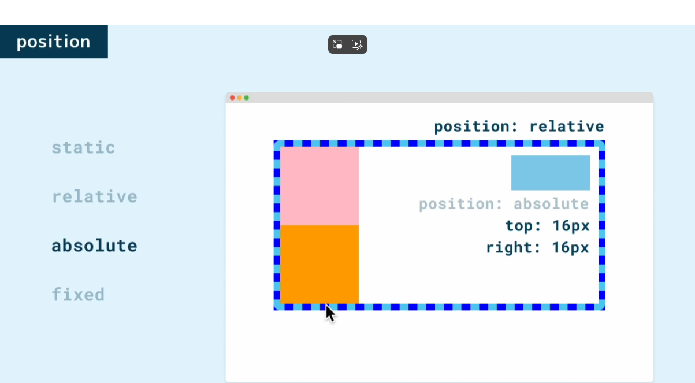

---

### fixed
- 固定位置指定で、絶対位置指定でブラウザで見ている領域が基準になったときとほぼ同じ動作をします
- position: fixed にすると、スクロールしてもその要素はここにとどまり続ける

CSSコード(.box-2 を抜粋)
```css
.box-2 {
  width: 100px;
  height: 40px;
  background-color: skyblue;
  /* position: relative; */
  /* position: absolute; */
  position: fixed;
  top: 16px;
  right: 16px;
}
```
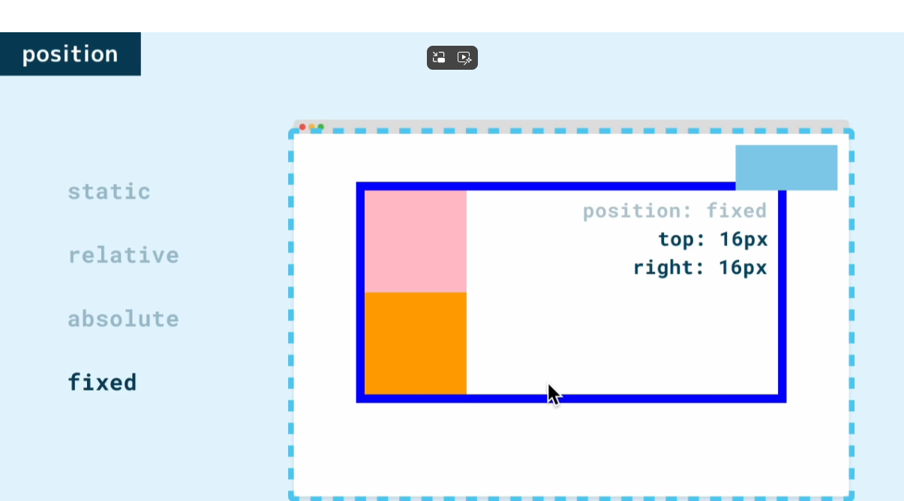


---

## [z-indexプロパティで要素の重なり順を制御]

HTMLで書いた順に配置されるので、HTMLで順番を意識して書いてもよいが、CSSで`z-index`を使って制御できる  
`z-index`で大きな数値を設定するほど前に配置される  

CSSコード
```css
.box-1 {
  width: 100px;
  height: 100px;
  background-color: pink;
  position: absolute;
  top: 0px;
  left: 0px;
  z-index: 3;  <-- 一番上に表示
}

.box-2 {
  width: 100px;
  height: 100px;
  background-color: skyblue;
  position: absolute;
  top: 20px;
  left: 20px;
  z-index: 2;  <-- 二番目に表示
}

.box-3 {
  width: 100px;
  height: 100px;
  background-color: orange;
  position: absolute;
  top: 40px;
  left: 40px;
  z-index: 1;  <-- 一番下に表示
}
```

---

## [object-fit, opacityプロパティ]

### オリジナル画像のイメージを壊さずに加工やボカシ

- object-fit: cover; 画像の比率をそのままにする
- opacity: 0.3; 設定値は0～1で、0に近づくほど薄くなる

HTML(画像設定)
```html
<body>
  
  
</body>
```
CSS
```css
img {
  width: 80px;
  height: 100px;
  border-radius: 50%;  <-- 円や楕円にする
  object-fit: cover;  <-- オリジナル画像の比率を守ってイメージをそのままにする
  opacity: 0.3;  <-- 薄い画像にする
}
```

---

## [baseline(vertical-alignプロパティ)]

### baselineとは

`baseline` は英字フォントに設定されているもので、この英字の土台になっているこの線のこと  
そして英字の場合、この y や p のように `baseline` より下にはみ出す部分もあるため、この下に隙間を確保しているという仕組みになっている  
よって、下側に隙間ができている  

pタグにimgタグを配置
```html
</head>
<body>
  <p>
    
        
  </p>

</body>
```
CSS(インラインで画像を配置)
```css
p {
  background-color: pink;
}

img {
  width: 80px;
  height: 80px;
  object-fit: cover;
}
```
上記コードの結果

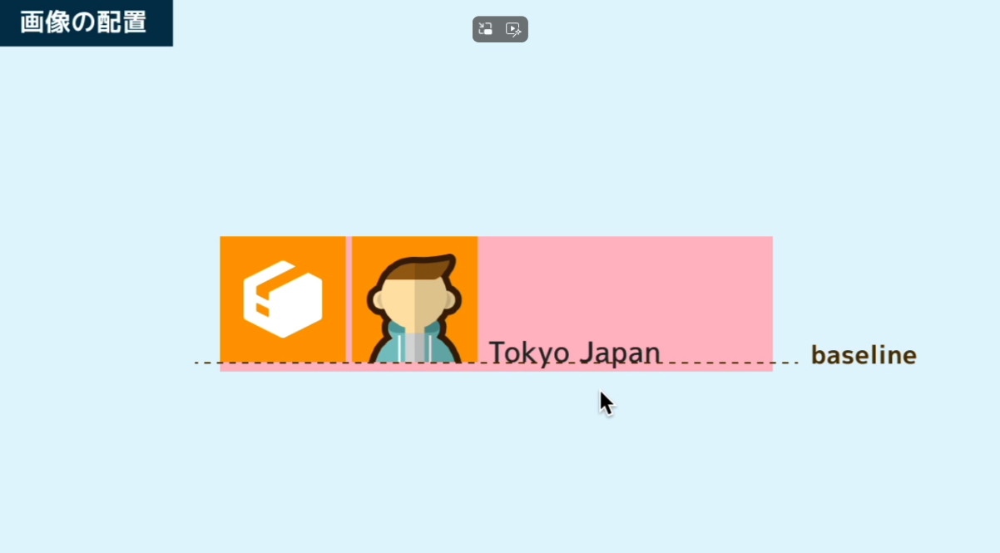


---

### vertical-alignプロパティ

**`baseline`を軸に`vertical-align`で画像の位置を調整**

注意点: このプロパティはインラインボックスの要素のみ使える

`vertical-align: 16px;` の挙動

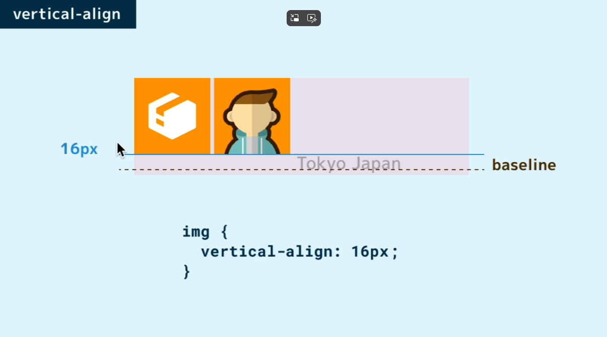

`vertical-align: -16px;` の挙動

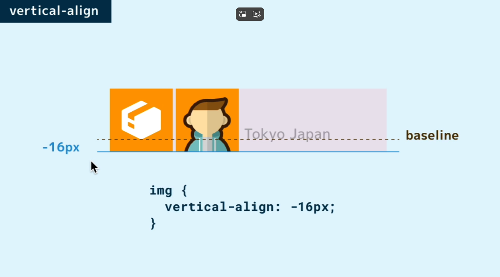

`vertical-align: bottom;` で行ボックスの下段に配置

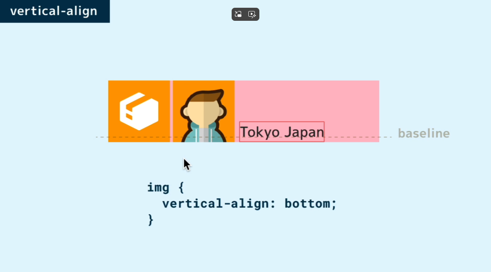

---

## [float, display, clearプロパティ]

**floatプロパティ**  
- 要素を左右どちらかに寄せることができる
- 要素を`float`させると通常の配置から外れて、無かったかのうように配置される  
- サイズ感によってはブロックボックスからはみ出す

**displayプロパティ**
- `display: flow-root;`で`float`させた子要素も自身のブロックボックスに含める

**clearプロパティ**
- `float`させた要素をこの段落では解除するという意味

```css
img {
  width: 80px;
  height: 80px;
  float: right;   <-- 右側にフロートさせる
}

.p-1 {
  display: flow-root;   <-- フロートさせた要素をブロックボックスに含める
}

.p-2 {
  /* clear: right; */   <-- フロートさせた要素が被ったときなどに被らない位置から段落が始まる
}
```

---

## [背景画像]

### まずは基本の書き方

HTML
```html
<body>
  <header>
    <h1>ドットインストール</h1>
  </header>
</body>
</html>
```
CSS
```css
header {     <-- ヘッダーはデフォルトで余白が無いので margin: 0; は不要となる
  height: 160px;
  background-color: pink;
  background-image: url(logo.png);  <-- 背景画像指定
}

h1 {
  margin: 0;
  font-size: 22px;     <-- フォントサイズ変更
  text-align: center;  <-- テキストを左右センターへ
  line-height: 160px;  <-- テキストを上下センターへ
}
```
結果
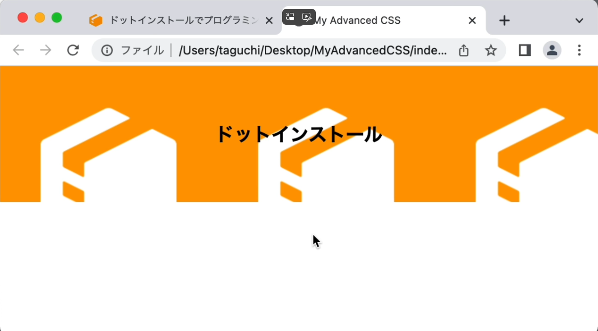

上記のようにデフォルトでは画像本来の大きさのまま、左上から敷き詰められていく

---

### さまざまなプロパティ

**background-size**
- 画像のサイズを指定して敷き詰めたい場合
- 幅と高さを指定すれば、その大きさで敷き詰める
- `contain`とすれば、画像がはみ出さない最大の大きさで敷き詰めてくれる
- `cover`とすれば、縦横比を保ちながら、はみ出してもいいのでなるべく大きく表示

**background-position**
- `center`とすれば、左上を起点に配置するのではなくて、画像を中央に寄せにする

**backgroundの一括指定プロパティ**
- `background: url(logo.png) center/cover pink`のように一括で指定できる
- `size`だけは、`position`のあとに`/`で区切って指定
- `background-color: pink;`も`background: pink`と書いてもOK

CSSを以下のように書き換えて、sizeをcoverにしてみた
```css
header {
  height: 160px;
  background: url(logo.png) center/cover pink;
}

h1 {
  margin: 0;
  font-size: 22px;
  text-align: center;
  line-height: 160px;
}
```
結果
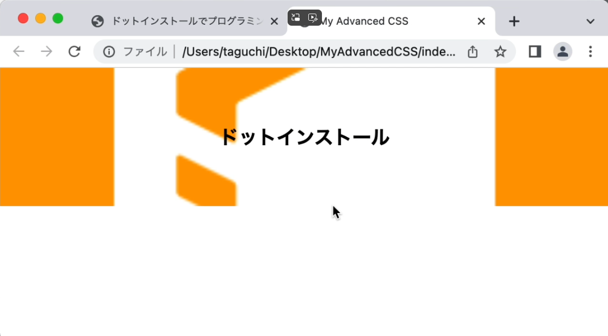

画像があるのに`pink`を指定しているのは、なんらかの問題が発生して画像を表示できなかった場合の応急処置  
また、画像を透過させた場合には背景色が出てくる  
ただし、CSSでは画像を透過できない(画像編集ソフトなどによる)  

---

## [リンクのスタイリング]

HTML
```html
<body>
  <a href="">リンク</a>
</body>
```
CSS
```css
a {
  display: inline-block;
  width: 160px;
  height: 32px;
  border: 1px solid black;
  border-radius: 8px;
  text-align: center;
  line-height: 32px;    <-- 明示的に 32px と指定
  text-decoration: none;  <-- リンクのアンダーラインを消す
  color: inherit;  <-- リンク文字に使用されている色を継承する
}
```
a 要素はインラインボックスでサイズの指定ができないので、`display`プロパティを変更  
サイズを指定するには、`block`か`inline-block`にする必要がありますが、ボタンが二つ以上あったら横に並んでほしいので、今回は`inline-block`を指定

結果
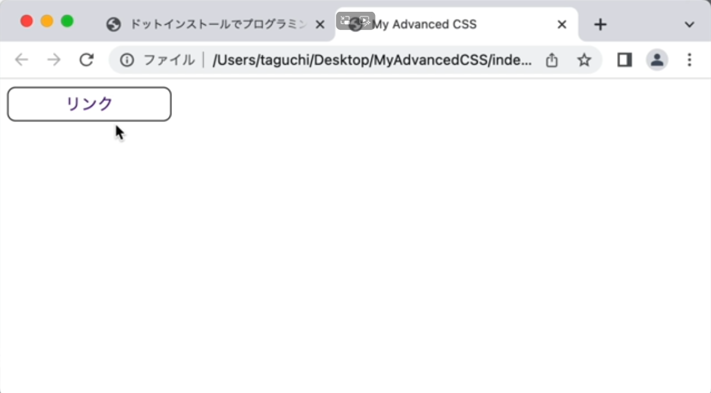

---

## [ボタンのスタイリング]

フォーム部品はブラウザによってデフォルトで付けるスタイルが大きく異なっている  
そこで、フォーム部品をスタイリングしたい場合、一旦全てのスタイルをリセットしてからスタイリングする、というテクニックがよく使われる  
全てのスタイルをリセットするには`all: unset;`を使う  

HTML
```html
<body>
  <button>OK</button>
</body>
```
CSS(リンクと比較した感じで表現した)
```css
button {
  all: unset;
  /* display: inline-block; */  <-- ボタンはブラウザがデフォルトでinline-blockを設定しているので不要
  width: 160px;
  height: 32px;
  border: 1px solid black;
  border-radius: 8px;
  text-align: center;
  line-height: 32px;
  /* text-decoration: none; */  <-- ボタンには下線が設定されていないので不要
  /* color: inherit; */  <-- ボタンにも文字色は設定されていないので不要
  cursor: pointer;  <-- マウスホバーしたときにカーソルの形を変える
}
```
`all: unset;`をした際には`cursor: pointer;`を設定する必要がある  
デフォルトでは設定されているが、リセットすることで設定が必要となるため  

---

## [テーブルのスタイリング]

HTML
```html
<body>
  <table>
    <thead>
      <tr><th>年</th><th>出来事</th></tr>
    </thead>
    <tbody>
      <tr><td>2011</td><td>サービス開始</td></tr>
      <tr><td>2022</td><td>256times開始</td></tr>
    </tbody>
  </table>
</body>
```
CSS
```css
table {
  border-collapse: collapse;  <-- 各要素間の隙間がなくなる
  width: 400px;  <-- テーブル全体の幅
}

th {
  border: 1px solid black;
  padding: 8px;             <-- ゆとりを作り視認性を高める
  background: lightgray;    <-- columnに配色
}

td {
  border: 1px solid black;
  padding: 8px;             <-- ゆとりを作り視認性を高める
}
```
結果
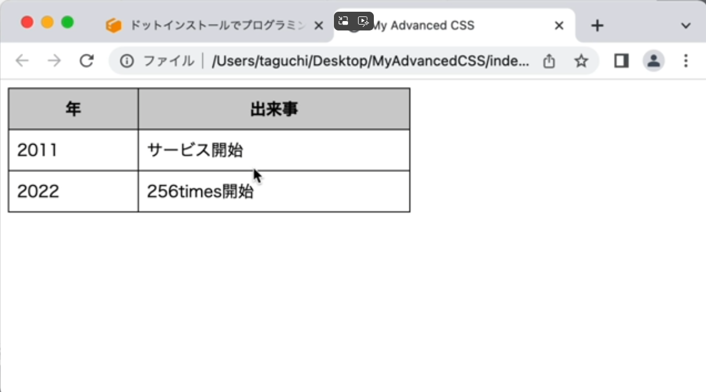

- セル内の文字をセンターにするには`text-align: center;`でOK
- columnのそれぞれの幅はブラウザが自動で設定している

### column幅を設定する

クラスセレクターを使う

HTML
```html
<table>
<thead>
    <tr><th class="year">年</th><th class="event">出来事</th></tr>
</thead>
<tbody>
    <tr><td>2011</td><td>サービス開始</td></tr>
    <tr><td>2022</td><td>256times開始</td></tr>
</tbody>
</table>
```
CSS
```css
.year {
  width: 50%;
}

.event {
  width: 50%;
}
```

---

## [リストのスタイリング]

よくあるパターンのリスト  
HTML
```html
<body>
  <ul>
    <li>Item 1</li>
    <li>Item 2</li>
    <li>Item 3</li>
  </ul>
</body>
```
CSS
```css
ul {
  /* all: unset; */  <-- リセットでもOK
  margin: 0;
  padding: 0;
  list-style: none;
}

li {
  background: lightgray;
  padding: 8px;
  border-radius: 8px;
  margin-bottom: 8px;  <-- リスト間の隙間をあける
  width: 320px;
}
```
結果
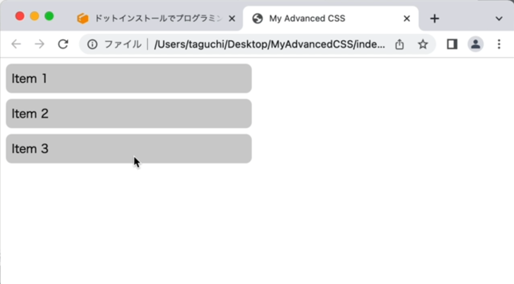

箇条書きリスト、順序付きリスト、説明リストともに、基本的にはブラウザがデフォルトでつけているスタイルを調べて、それをリセットしてから、自由にスタイリングしていくという手順になる  

**ブラウザがデフォルトでつけているスタイルを調べる方法**

ブラウザの開発者ツール -> ユーザーエージェントスタイルシート  


---

## Diary  
今日は衆議院選挙へ行ってきました  
高市総理の影響で投票率は少し上がると思っていたが、  
雪などの影響でそんなに変わらないかもしれないな  
前に麻生さんが「投票率が低いのは平和な証拠だ」と言っていた  
確かにそうだと思う、治安が悪かったり混沌とした国はほとんど投票率が高い  
この状況、悪く言えば「平和ボケしたニッポン」なのだろう  
残念ながら頑なに選挙に行かない大人たちを変えるのは難しい  
期待できるのはこれからの若者だな  
良い未来とこれからの若者のために高市総理に期待したい  

晩飯はエビフライとホタテフライとジャガイモの素揚げ  
おつまみにマグロブロックのクリームチーズとキムチあえ  
もずくの味噌汁とサラダで超贅沢三昧  
酒が進むなこりゃ  
