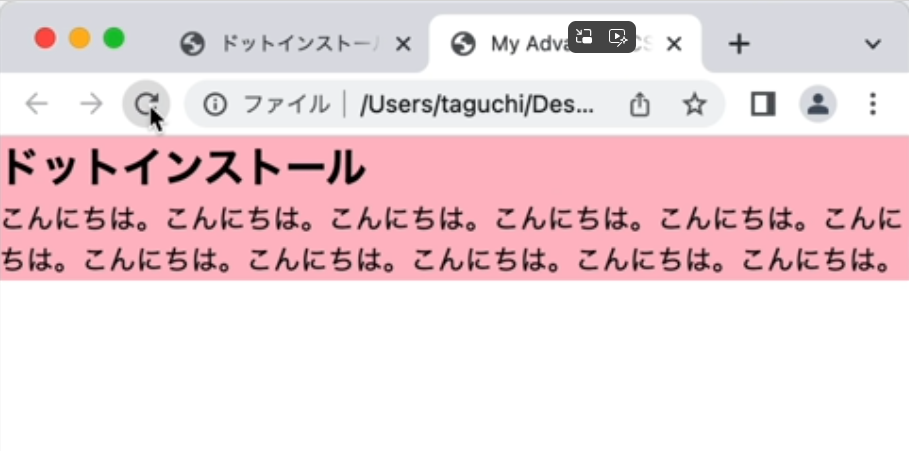
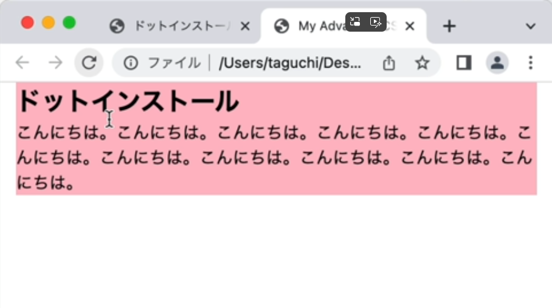
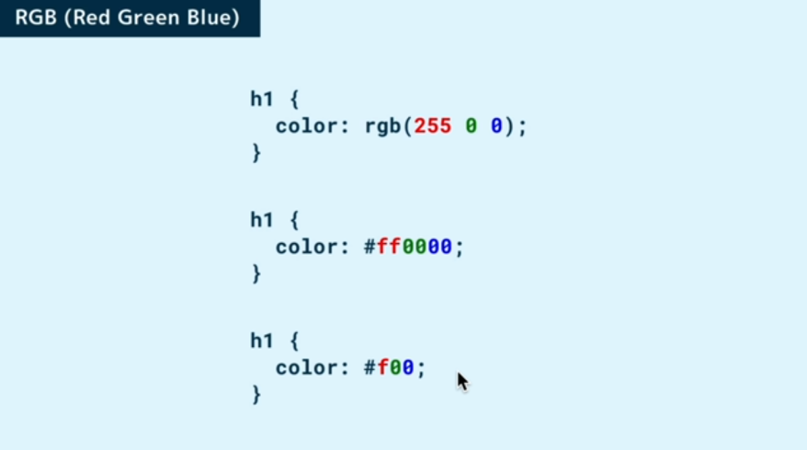
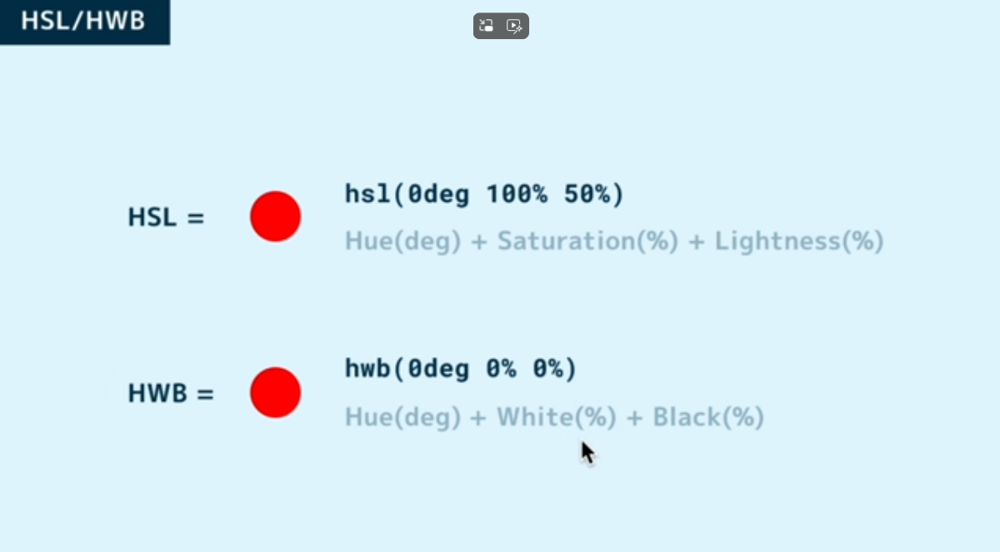
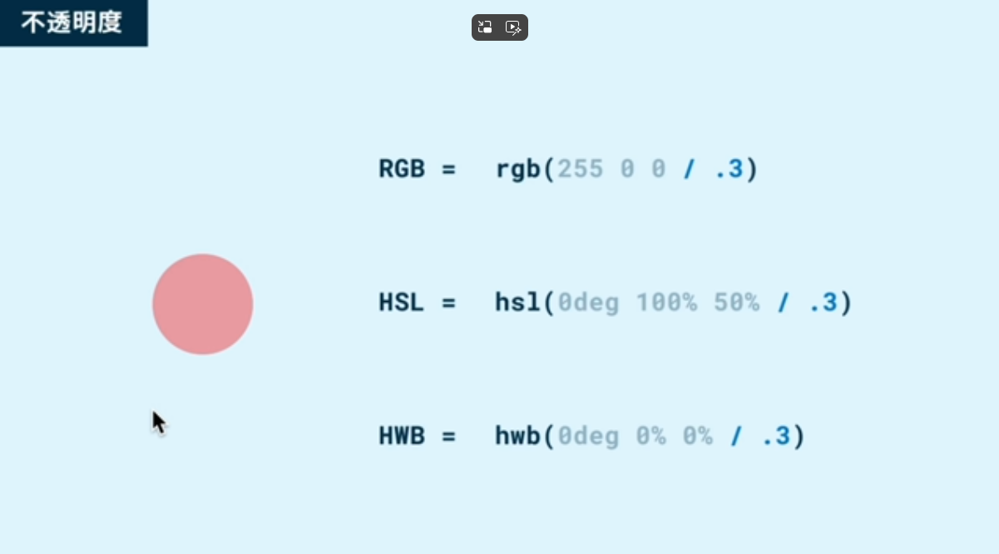
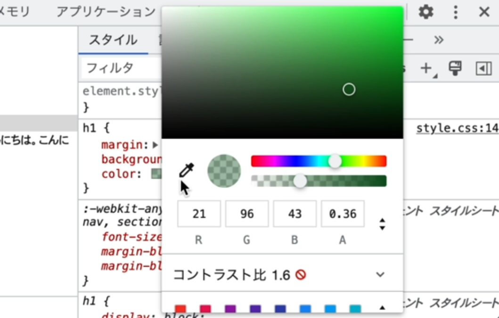
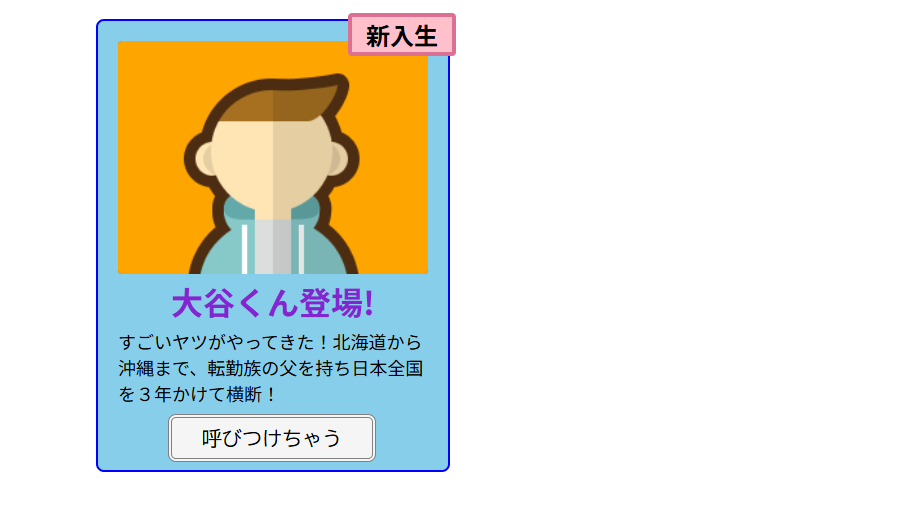

# [HTML/CSS] 

**Date:** 2026年2月9日  
**Study Time:** 2.5時間  
**TAG:** #MySQL #Python #GitHub #WindowsServer

## 1. Today
- calc()を使った単位の異なる計算
- 単位 em, rem
- 色の指定方法
- カラーピッカーの使い方
- CSS変数

## 2. Record & Comment 

## [calc()を使った単位の異なる計算]

### 横幅100%から左右16pxずつあける方法

HTML
```html
<body>
    <section>
        <h1>ドットインストール</h1>
        <p>こんにちは！こんにちは！こんにちは！こんにちは！こんにちは！こんにちは！こんにちは！こんにちは！こんにちは！こんにちは！こんにちは！</p>
    </section>
</body>
```
CSS
```css
section {
    background-color: pink;
    max-width: 600px;
    margin: 0 auto;
    width: calc(100% - 16px - 16px);  <-- calc()で設定
}

h1 {
    margin: 0;
}

p {
    margin: 0;
}
```

**`calc()`を使用する前**


**`calc()`を使用して左右`16px`空白があくようにした**


---

## [単位 em, rem]

### em

それぞれの要素に設定されているフォントサイズの文字数分を指す  

```css
p {
    wigth: 6em;  <-- p要素の6文字分の幅という意味になる
}
```

### rem

文書全体に設定されたフォントサイズの文字数分を指す  
html要素に設定されたフォントはたいてい16pxになっている  

```css
p {
    wigth: 6rem;  <-- html要素の6文字分の幅という意味になる
}
```

---

## [色の指定方法]

### [RGB]  
Red 、 Green 、 Blue をどれだけ混ぜるかで色を作る方法  

それぞれを 0 から 255 の数値で指定する  
red は 255 で目一杯、 green と blue は 0 で混ぜないという意味なので、これは赤を意味する  
中段は # として、これらの数値を 2 桁の 16 進数で表現  
255 は 16 進数だと ff 、 0 は 00 なので、このようにすれば、上と全く同じ意味になる  
2 桁が同じ文字だった場合は圧縮できるので、下段はこのように短く書いても OK


### [HSL HWB]  

色相は英語で Hue で、 degree つまり角度で指定  
0 度にすると赤で、そこから 120 度までは徐々に緑になって、 240 度までは青、そして赤に戻るといった具合  
.png)

この色相環に加え、鮮やかさである彩度 Saturation と、輝度を表す Lightness を % で指定するのが HSL という形式で、  
彩度と輝度がややわかりにくいので、黒と白をどれだけ混ぜるかで表現する方法として最近作られたのが HWB  
2:06
例えば赤だったら、 HSL では色相環で 0 度の位置、鮮やかさは 100％ 、明度は明るすぎると真っ白になってしまうので、 50% とする  
一方、 HWB では色相環で 0 度の位置、黒と白は混ぜなければいいので、両方とも 0% とすれば OK


これらの表現方法は、どれも最後に / をつけて 0 から 1 で不透明度を指定することができる  
例えば / .3 ぐらいにすると、うっすらと透明な赤になる  


---

## [カラーピッカーの使い方]

### Chromeの開発者ツール内のカラーピッカー

Chromeの開発者ツールに出てくるカラー見本をクリック  
詳細画面が出てきて、色相や透明度を変えて色を指定できたり  
色の指定方法を下の方で変えたりできる  
さらにスポイトアイコンをクリックすると画面上の色を拾える  
欲しい色のところでクリックするとその色が反映される  


---

## [CSS変数]

`:root`で変数を設定できる  
変数名は`--`で始める  

```css
:root {
    --brand-color: orange;  <-- 変数名(--brand-color) 値(orange)
}

section {
    max-width: 600px;
    margin: 0 auto;
    width: calc(100% - 16px - 16px);
}

h1 {
    margin: 0;
    color: var(--brand-color);  <-- var()の中に変数名を指定
    border-bottom: 2px solid var(--brand-color);  <-- var()の中に変数名を指定
}
```

---

## [練習]

HTML
```html
<!DOCTYPE html>
<html lang="ja">
<head>
    <meta charset="UTF-8">
    <meta name="viewport" content="width=device-width, initial-scale=1.0">
    <title>Document</title>
    <link rel="stylesheet" href="style.css">
</head>
<body>
    <section class="students">
        <h2>新入生</h2>
        
        <h1>大谷くん登場!</h1>
        <p>すごいヤツがやってきた！北海道から沖縄まで、転勤族の父を持ち日本全国を３年かけて横断！</p>
        <button>呼びつけちゃう</button>
    </section>
</body>
</html>
```

CSS
```css
@charset "utf-8";

body {
    margin: 0;
}

.students {
    margin: 32px auto;
    background-color: skyblue;
    width: 350px;
    border-radius: 8px;
    position: relative;
    border: 2px solid blue;
}

h2 {
    margin: 0;
    text-align: center;
    font-size: 24px;
    width: 100px;
    background-color: pink;
    border: 4px solid palevioletred;
    border-radius: 4px;
    position: absolute;
    top: -8px;
    right: -8px;
}

img {
    background-color: brown;
    margin: 20px 20px 0;
    border-radius: 4px;
    vertical-align: bottom;
}

h1 {
    color: rgb(132, 37, 209);
    text-align: center;
    margin: 4px;
}

p {
    margin: 0;
    padding: 0 20px 8px;
    font-size: large;
}

button {
    all: unset;
    background-color: whitesmoke;
    margin: 0 70px 8px 70px;
    border: 4px double gray;
    width: 200px;
    height: 40px;
    border-radius: 8px;
    text-align: center;
    cursor: pointer;
    font-family: monospace;
    font-size: 20px;
}
```
結果


---

## Diary  
練習での課題は画像とボタンのセンターへの入れ方  
また明日調べることにしよう  
もう眠いっす  

明日仕事したら明後日休み、やっぱ水曜休みはイイ！  
来月か再来月あたりキャンプでも行きたいな  
それにしてもCSSのレッスン、めっちゃあるな  
JavaScriptと並行してやってこっかな～