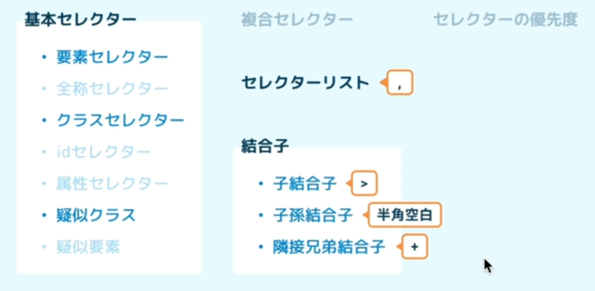
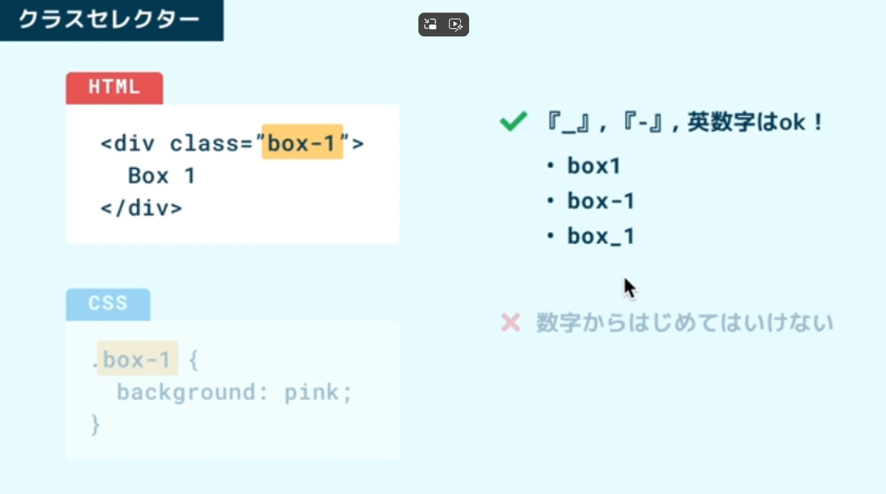
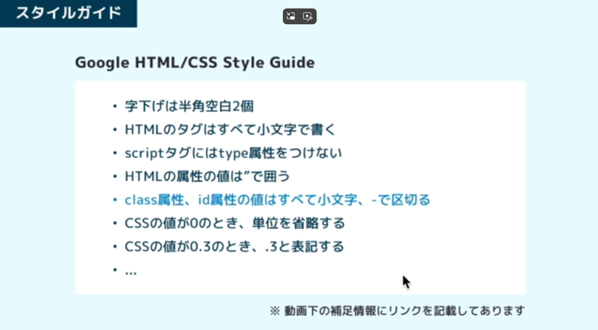
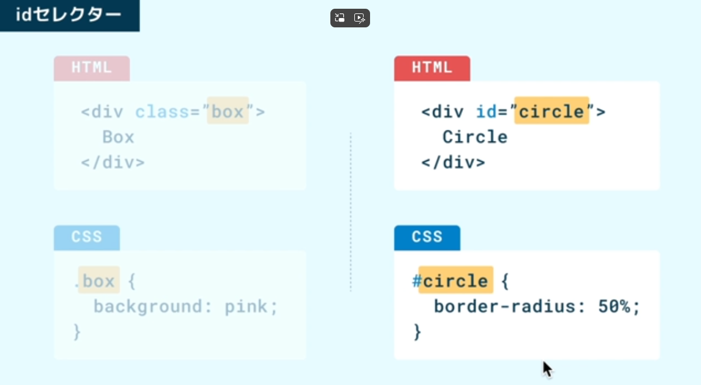
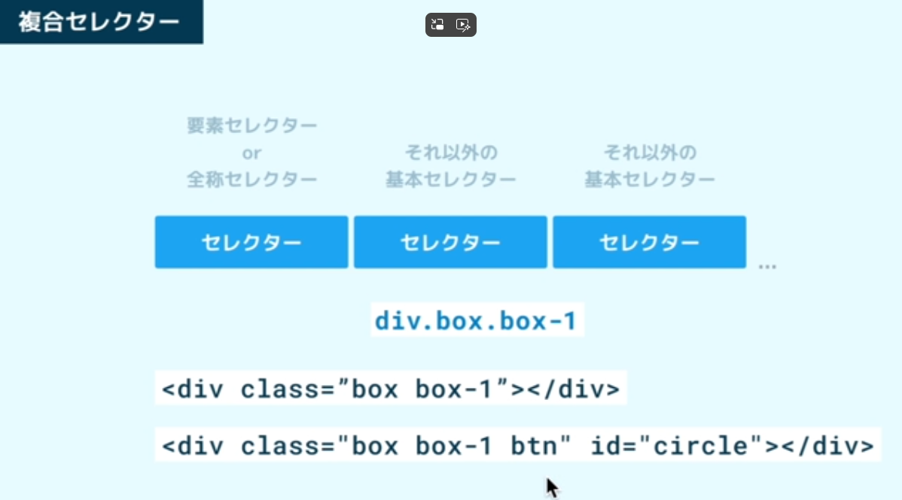
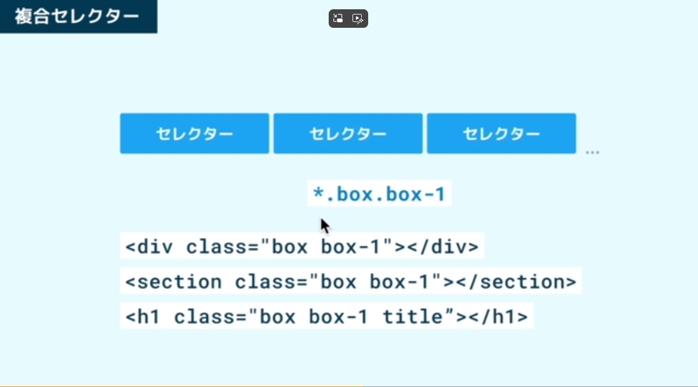
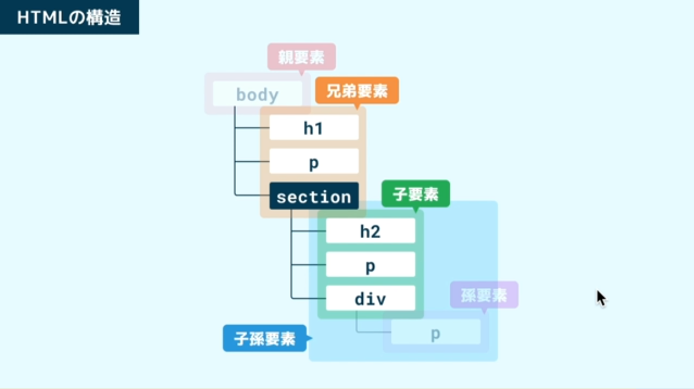
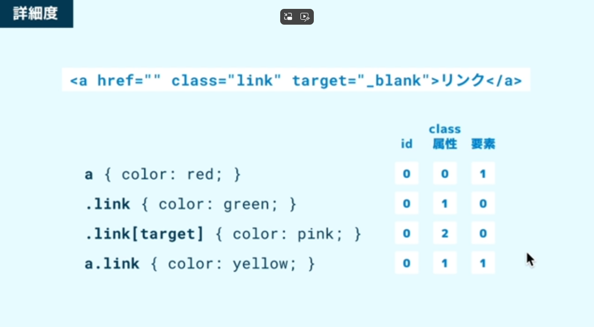

# [HTML/CSS セレクター] 

**Date:** 2026年2月11日  
**Study Time:** 7時間  
**TAG:** #HTML/CSS

## 1. Today
- 基本セレクター
- 結合子
- 疑似クラス
- 詳細度

## 2. Record & Comment 

## [基本セレクター]

### セレクターの種類（よく使われるものが太字）


### [要素セレクター]

`タグ名`をそのまま使う
```css
h1 {
  background: pink;
}
```

### [全称セレクター]

`すべての要素`を意味する`*`を使う
```css
* {
  margin: 0;
  box-sizing: border-box;
}
```
html, body タグにも反映されるので注意が必要

### [クラスセレクター]

`クラス属性`を使う


名付けルールがあるので以下のようなものを参考にすると汎用性が高まる  
Google社が推奨している Styli Guide  


### 重要
class 属性は、`空白で区切って`複数の値を指定できる  
同じ値を複数の要素に設定することもできるという特徴があり  
その特徴を活かして、以下のように共通のスタイルは共通のクラスセレクターで、  
個別のスタイルは個別のクラスセレクターで指定するといったテクニックもよく使われる  
HTML
```html
<body>
  <div class="box box-1">Box 1</div>  <-- 複数のclass属性を設定
  <div class="box box-2">Box 2</div>  <-- 複数のclass属性を設定
</body>
```
CSS
```css
.box {           <-- 親要素で指定して全体へ反映
  width: 160px;
  height: 80px;
}

.box-1 {              <-- 子要素で指定して個別に指定
  background: pink;
}

.box-2 {              <-- 子要素で指定して個別に指定
  background: skyblue;
}
```

### [idセレクター]



**クラスセレクターとの違い**
- 複数の値を設定することができない
- 同じページ内で複数の要素に同じ値を設定することができない

JavaScriptでよく使われる

### [属性セレクター]

属性とその値で選択できる  
`[]`で表現する  
HTML
```html
<body>
  <a href="">リンク</a>
  <a href="" target="_blank">リンク</a>  <-- target属性
  <a href="">リンク</a>

  <input type="text">
  <input type="password">
</body>
```
CSS
```css
[target] {           <-- []で属性名を示す
  font-weight: bold;
}

[type="password"] {      <-- 値を含めることもできる
  border: 8px solid blue;
}
```
### [複合セレクター]

**複合セレクターとは、基本セレクターを 2 つ以上繋げたセレクター**

**要素セレクターの場合**


**全称セレクターの場合（先頭の`*`は省略可能）**


HTML
```html
<body>
  <div class="box">Box</div>  <-- 選択される
  <div class="box">Box</div>  <-- 選択される
  <div>Box</div>
  <section class="box">Box</section>
</body>
```
CSS
```css
div.box {
  color: red;
}
```

### [セレクターリスト`,`]

要素を`,`で区切って複数の要素を選択できる

`h1`と`p`を選択した例
```css
h1, 
p {
  background: pink;
}
```

---

## [結合子]

### HTMLの構造（sectionから見た構造）


### [子結合子`>`]

**`section直下`の`p`を参照する**  

子要素の`p`のみ選択（上図を参照）
```css
section > p {
  color: red;
}
```

### [子孫結合子` `(半角空白)]

**`section以降`の`p`を参照する**  

子要素と孫要素の`p`が選択（上図を参照）
```css
section p {
  background: skyblue;
}
```

### [隣接兄弟結合子`+`]

以下のように書くことで、`+`の後に続く要素が選択される
```css
li + li {}
```
例えば、以下場合は`dic`が選択される
```css
li + div {}
```
以下のような実例では、2番目から4番目の`li`が選択される
```html
<body>
  <ul>
    <li>項目</li>   <-- 選択されない
    <li>項目</li>   <-- 選択
    <li>項目</li>   <-- 選択
    <li>項目</li>   <-- 選択
  </ul>
</body>
```
```css
li + li {                    <-- + で記述する
  border-top: 1px solid red;
}
```

---

### [疑似クラス]

### `:nth-child()`  
兄弟要素のうち何番目にあるかという状態を表現するための擬似クラス  
疑似クラスは : から始まるが、この : のあとに空白を入れてはいけない  

以下のように指定すると3番目の子要素を指す  
```CSS
:nth-child(3) {
  color: red;
}
```
HIMLが以下の場合は、  
`ul`の子要素`li`の3番目と、  
`body`の子要素`p`の2番目が選択される(ul -> p -> p となる)  
```html
<body>
  <ul>
    <li>項目</li>
    <li>項目</li>
    <li>項目</li>  <-- 選択される
    <li>項目</li>
    <li>項目</li>
    <li>項目</li>
    <li>項目</li>
  </ul>
  <p>こんにちは。</p>
  <p>こんにちは。</p>  <-- 選択される
</body>
```
`li`の要素だけ選択したい場合は複合セレクターを使う
```css
li:nth-child(3) {
  color: red;
}
```

### `:nth-child()`の他の使い方  
- `odd` 兄弟要素の偶数番を選択
- `even` 兄弟要素の奇数版を選択
- `n` に順番に 0 から数値が代入されいき、該当する要素を選択
- `:firdt-child` 兄弟要素の最初の要素
- `:last-child` 兄弟要素の最後の要素

```css
li:nth-child(odd) {
  color: red;
}

li:nth-child(even) {
  color: red;
}

li:nth-child(3n) {  <-- 3の倍数で選択
  color: red;
}

li:first-child {
  background: pink;
}

li:last-child {
  background: skyblue;
}
```

### その他の疑似クラス
- `:hover` マウスホバーという状態を表す
- `:focus` input 要素のような focus が持てる要素に対して使う
- `:active` ボタンを押し込んだり要素をクリックしたときの状態を表現する
- `:not` 除外したい要素を指定する

HTML
```html
<body>
  <input type="text">
  <button>OK</button>
</body>
```
CSS
```css
button:hover {     <-- ボタンの上までカーソルが来た時に反応
  font-weight: bold;
}

input:focus {      <-- テキストボックスをクリックすると反応
  border: 8px solid blue;
}

button:active {    <-- ボタンが押されているときだけ反応
  border: 8px solid red;
}
```
CSS `:not`
```css
div:not(.box) {
  border: 1px solid red;
}
```

### [疑似要素]

いくつかの種類があるが、よく使われるのは `::before` と `::after`  
疑似要素は擬似クラスと違って、 : （コロン） 2 つから始まる  

HTML
```html
<body>
  <p>こんにちは。</p>
</body>
```
CSS
```css
p::before {
  content: '- ';
}

p::after {
  content: ' -';
}
```
結果
```bash
- こんにちは。 -
```

こうした装飾的な要素をたくさんの要素につけていた場合、  
HTML の中に書いていると、すべての箇所を修正しないといけない  
疑似要素で書いていた場合、ここだけを修正すればいいので、変更に強いコードになる、というメリットがある  

---

### [詳細度]

### セレクターの優先度

セレクターには詳細度というスコアがあって、そのスコアが最も高いものが優先されるというルール  

- 最初の数値はセレクターの中に id セレクターが現れる回数
- 次の数値はクラスセレクター、擬似クラス、属性セレクターが現れる回数
- 最後が要素セレクター、疑似要素が現れる回数

これらのスコアが高いか低いかは、左側の数値から勝ち抜き戦の要領で見ていけば OK  
以下の例では3番目が優先となる  


**重要**  
以上のことから優先度は決まるが、実際にそれを調べる場合はコードが長いほど検証に時間が掛かってしまう  
そこでブラウザで表示された対象に右クリックで検証を指定して 開発者モードから確認するのが現実的  
開発者モードでは詳細度の高い順に並べられているのですぐに確認できる  

### 詳細度を上げる方法
例 1
```css
/* 最後に指定したコードで詳細度が低かった場合 */
a.link {
  color: yellow;
}

/* あえて属性を追加して詳細度を上げる */
a.link[target] {
  color: yellow;
}
```

例 2
```css
/* HTMLの方で style属性 を使って直接指定する */
<body>
  <a href="" class="link" target="_blank" style="color: orange;">リンク</a>
</body>
```

例 3 (非推奨とされている)
```css
/* !important をCSSの方につけて最優先に設定する */
a {
  color: red !important;
}
```

---
一つの区切りまで到着した  
このまま突き進むが、ここからは JavaScript も並行して進める  
マークダウンもかなり慣れたけど、なんか簡単に作れるアプリとかありそうだな  
或いはPythonで作ってしまおうか  
いやいや余計なことはやめましょう  

今日はカルディで50p入りのダージリンティーを買った  
いつもの25p入りと違うみたいだけど楽しみです、後から飲もっと  
そろそろいざわさんに行かんといかん  
そういえば左足の痛みもほのかに残ってるな  
いつか元気な体に戻る時は来るのだろうか  
信じてすこしづつ体重を落とすしかないね  